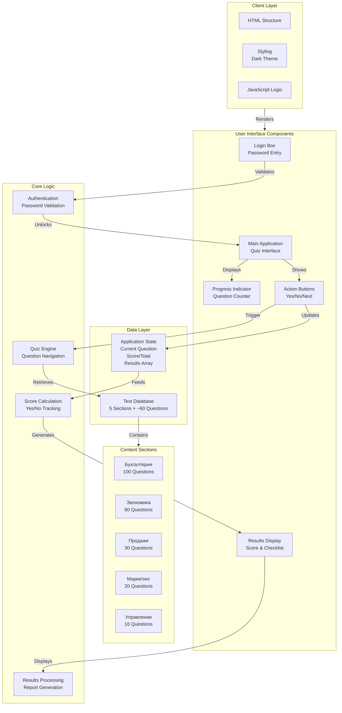
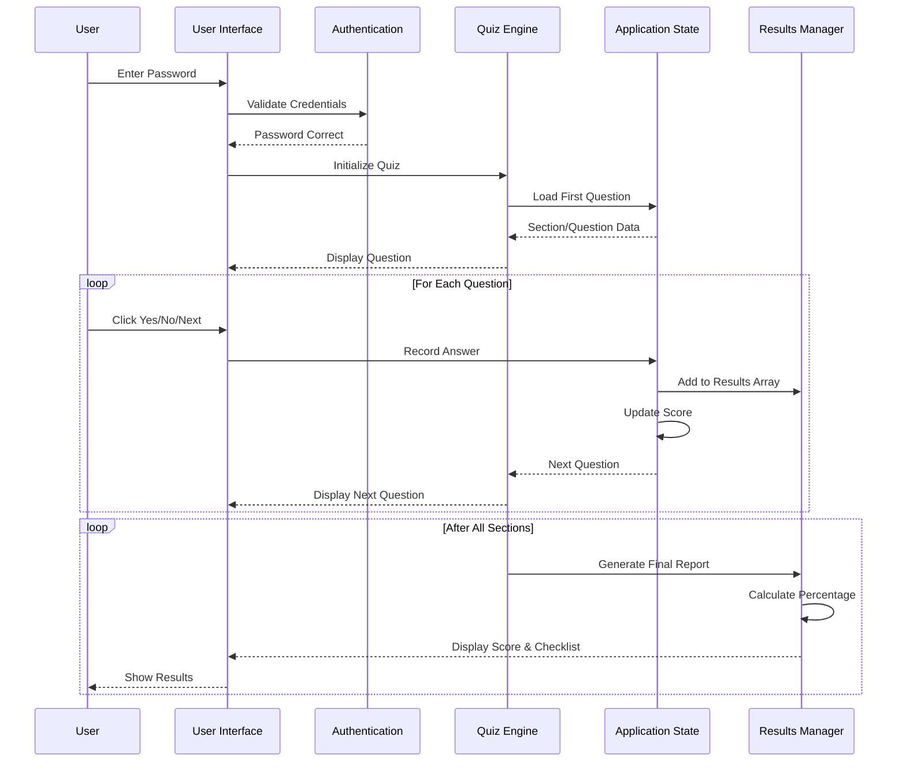
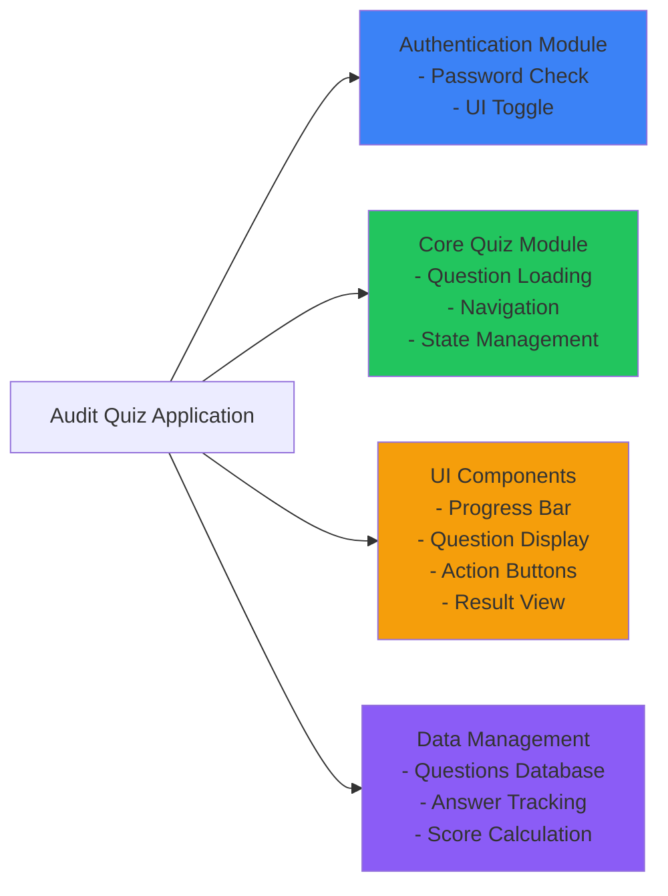

# Audit Questionnaire Application - Architecture Overview

## System Architecture

## Data Flow Diagram

## Component Structure

## Key Features

| Feature | Component | Purpose |
|---------|-----------|---------|
| **Authentication** | Login Box | Secure access with password |
| **Quiz Navigation** | Question Loader | Display questions one by one |
| **Progress Tracking** | Progress Bar | Show current position in quiz |
| **Answer Recording** | Buttons (Yes/No) | Capture user responses |
| **State Management** | JavaScript State | Track score, total, results |
| **Result Generation** | Results Display | Show final score & full checklist |
| **Data Storage** | Tests Object | 5 sections with ~220 total questions |

## Technology Stack

- **Frontend**: HTML5, CSS3, JavaScript (Vanilla)
- **Styling**: Dark theme with color-coded buttons
- **Data Storage**: JavaScript Object (in-memory)
- **Authentication**: Simple password validation
- **Architecture**: Single-page application (SPA)

## User Journey

1. **Login** → Enter password to access the quiz
2. **Quiz** → Answer questions across 5 sections sequentially
3. **Navigation** → Move through questions with "Yes", "No", and "Next" buttons
4. **Progress** → Track position with question counter
5. **Results** → View final percentage score and complete checklist of responses
